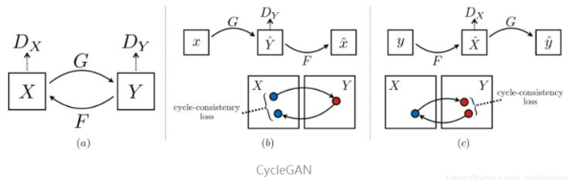

# Cyclegan

#####1.将图片转换成tfrecords格式

这个项目中提供了一个build_data脚本，用于将图片转换成tfrecords形式。假设我们的图片存放在~/datasets/man2woman/a_resized/和 ~/datasets/man2woman/b_resized目录下，对应的命令就是：

python build_data.py \
    --X_input_dir ~/datasets/man2woman/a_resized/ \
    --Y_input_dir ~/datasets/man2woman/b_resized/ \
    --X_output_file ~/datasets/man2woman/man.tfrecords \
    --Y_output_file ~/datasets/man2woman/woman.tfrecords
python build_data.py --X_input_dir datasets/man2woman/a_resized --Y_input_dir datasets/man2woman/b_resized --X_output_file datasets/man2woman/man.tfrecords --Y_output_file datasets/man2woman/woman.tfrecords
2. 训练

训练的命令为：

python train.py \
    --X ~/datasets/man2woman/man.tfrecords \
    --Y ~/datasets/man2woman/woman.tfrecords \
    --image_size 256
python train.py  --X datasets/man2woman/man.tfrecords --Y datasets/man2woman/woman.tfrecords --image_size 256
训练的过程比较漫长，此时可以打开TensorBoard来观察训练情况（运行这个命令时需要将“20170715-1622”改成机器中对应的文件夹，下同）：

tensorboard --logdir checkpoints/20170715-1622
3. 导出模型并执行单张图片

导出模型的方法为：

python export_graph.py \
    --checkpoint_dir checkpoints/20170715-1622 \
    --XtoY_model man2woman.pb \
    --YtoX_model woman2man.pb  \
    --image_size 256
4.对单张图片进行转换（将data/test.jpg替换为对应的输入图片地址）：

python inference.py \
--model pretrained/man2woman.pb  \
--input data/test.jpg  \
--output data/output.jpg \
--image_size 256

5. 如果您停止了培训过程并希望继续培训，则可以load_model像这样设置参数。
python train.py \
    --load_model 20170602-1936
